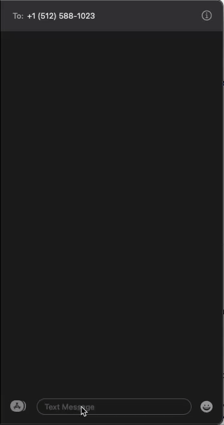
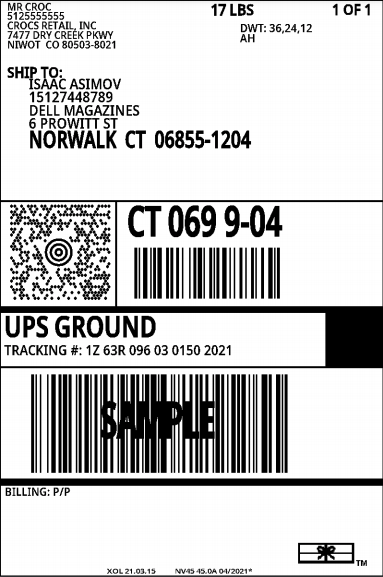

# ShipEngine SMS Label Creator
<div style="page-break-after: always;"></div>
An SMS auto-responder that creates shipping labels from natural language requests. 
</br></br>

## Sample Requests

> Send one to Josh Gotro please, 1113 Arthur Stiles Austin, TX

> Oh, and please ship to Isaac Asimov. They work for Dell Magazines. 6 Prowitt Street Norwalk 06855. I think that is Connecticut


&nbsp; &nbsp; &nbsp; &nbsp; &nbsp; &nbsp; 

---
## Framework 
&nbsp; &nbsp; &nbsp; Node.js &nbsp; &nbsp; &nbsp; | &nbsp; &nbsp; &nbsp; Express  
&nbsp; &nbsp; &nbsp; MongoDB &nbsp; | &nbsp; &nbsp; &nbsp; Mongoose  
&nbsp; &nbsp; &nbsp; React &nbsp; &nbsp; &nbsp; &nbsp; &nbsp; | &nbsp; &nbsp; &nbsp; Apollo  
&nbsp; &nbsp; &nbsp; Ngrok    

---
## Libraries & Dependancies
**Node.js**  

&nbsp; &nbsp; Express:  
&nbsp; &nbsp; Quickly creates a server side web application. 

&nbsp; &nbsp; Mongoose:  
&nbsp; &nbsp; Allows MongoDB object modeling

&nbsp; &nbsp; Plivo SDK:  
&nbsp; &nbsp; Integrates SMS communications

&nbsp; &nbsp; Lodash:  
&nbsp; &nbsp; Simplifies some javascript functions. 

&nbsp; &nbsp; Axios  
&nbsp; &nbsp; Makes writing asynchronous HTTP requests easier. 

&nbsp; &nbsp; Dotenv  
&nbsp; &nbsp; Load environment variables from a .env file. 

**React**  

&nbsp; &nbsp; Apollo:  
&nbsp; &nbsp; State management library that enables you to manage local & remote data with GraphQL

---
## Features

- Receive SMS at /sms endpoint.  
- Parse the text throught ShipEngine's natural language parser. 
- Verify and format the address through ShipEngine's Validate endpoint. 
- Create a label to the verified address, using default values. (From address, carrier, etc.)
- Reply to the SMS with a PDF of shipping label, and a tracking number. 
- Handles basic validation, such as returnin an error sms if the message cannot be validated. 

### Stretch Features
- React and Apollo are installed and ready for your CRUD actions to be added. 
- Mutations for creating Addresses and Labels can be found here:  
 `client/src/queries/queries.js`  
Have fun with it!

---
## Installation Instructions

1. Create a directory and clone this repository into it.  
2. Create a file in the root called ".env"
3. Follow the steps below to gather the credentials needed and add them to the code: 

ShipEngine
1. Sign up or sign into a [ShipEngine](https://app.shipengine.com/) account. 
2. Copy the [Sandbox](https://www.shipengine.com/docs/sandbox/) API key.
3 Paste into `server/.env` assigned to `API_Key`. It will look something like this:    

*ex:*  
 ```API_KEY=TEST_4HaHGNPNK6kdwhWpT14Wj7lvAaij36HxQ/2sFdC0czY``` 

Ngrok  
1. Sign up for an account.  
2. Follow the [download and unzipping](https://dashboard.ngrok.com/get-started/setup) instructions listed on their site based on your OS.  
*Note: Be sure to install in the root folder previously created to ensure it works with the current app settings.*
3. In a new tab, run the following command `./ngrok http 4000` from the terminal of your choice. 
4. Take note of the "forwarding" urls. You will use one of these in the next step. 

Plivo  
1. Follow the signup instructions to create and upgrade an account with [Plivo](https://console.plivo.com/accounts/register/).  
*Note: you may use a trial account, which includes free credits, but you will be restricted to testing only from your personal phone number.*  
2. Rent a number following [these instructions](https://support.plivo.com/hc/en-us/articles/360041397412-How-can-I-rent-a-phone-number-), ensuring to choose one that is SMS enabled. 
3. Create an application and assign your number to it following [these instructions](https://support.plivo.com/hc/en-us/articles/360041395852-How-can-I-set-up-an-application-and-assign-a-number-to-it-). 
4. Navigate to the application settings. In the "Message URL" field, enter one of the "forwarding" Ngrok urls with `/sms` appended to the end.  

*ex:*  
```https://ac3897e8fw31.ngrok.io/sms```

5. Copy your AuthID and Password from your [Plivo dashboard](https://console.plivo.com/dashboard/). 
6. Paste them into `server/.env` under the keys  `P_AUTH` and `P_TOKEN`.  

*ex:*  
```P_AUTH=MAZJJIZMYWZJC0OWMYZJ```  
```P_TOKEN=MDRkZWYzZDlhZmJhOTZlZWY5MjY0YzMyZDgxMzE4```

7. Copy the [number you rented](https://console.plivo.com/active-phone-numbers/) and add it to `server/.env` under the key  `P_NUMBER`.  
 
*ex:*  
```P_Number="+15555555555"```  

MongoDB  
1. Login or Sign up and try [MongoDB](https://www.mongodb.com/try) for free. (If you already have an account and can create a cluster, skip to step 7)
2. Click the green "Build a Cluster" button, then select your price tier (free). 
3. Choose the Cloud Providor and Region of your preference. (I used AWS/N. Virginia)
4. Click "Create Cluster", this will take some time to create. 
5. Choose a login and password when prompted. 
6. Once the Cluster is created, click the "Connect" button. 
7. Select "Connect your application"
8. Choose "Node.js" and "3.6 or later" from the dropdowns. 
9. Copy the connection string (ensure "Include full driver code example" is NOT selected)
10. Paste into `server/.env` assigned to `MongoURI`. It will look something like this:  

*ex:*  
 ```MongoURI='mongodb+srv://gotro:<password>@cluster0.vsufu.mongodb.net/myFirstDatabase?retryWrites=true&w=majority'```  
*Your username will be in the string, but you will need to replace `<password>` with your password.*


Command Terminal:
- In a new tab, `cd` into `/client` and run:  `npm install`
- Once completed, run: `npm start`

- In a new tab, `cd` into `/server` and run:  `npm install`
- Once completed, run 'nodemon app'


---
## Contact Me

Thank you! If you like what you see, or if you don't, feel free to reach out!

&nbsp; &nbsp; &nbsp; &nbsp; &nbsp; &nbsp; &nbsp; &nbsp; &nbsp; [Email](joshuagauthreaux@gmail.com)&nbsp; &nbsp; &nbsp; &nbsp; &nbsp;| &nbsp; &nbsp; &nbsp; &nbsp; [LinkedIn](https://www.linkedin.com/in/josh-gauthreaux/)&nbsp; &nbsp; &nbsp; &nbsp; &nbsp;| &nbsp; &nbsp; &nbsp; &nbsp; [Portfolio](https://www.joshgotro.com)&nbsp; &nbsp; &nbsp; &nbsp; &nbsp;| &nbsp; &nbsp; &nbsp; &nbsp; [Medium](https://medium.com/@joshuagauthreaux)


